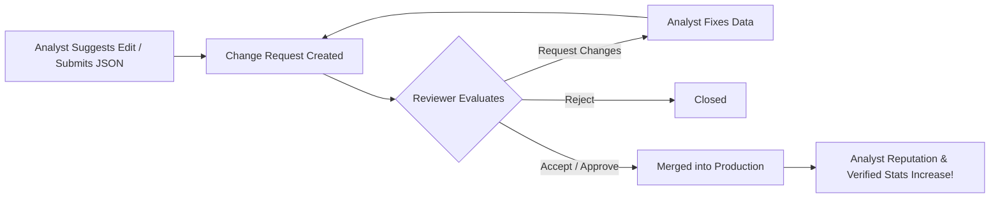

# 📊 Moncho Analyst Dashboard Walkthrough

Welcome to the **Analyst Dashboard Walkthrough**. While your local IDE is your "Data Engine" (Hub 1), the **Analyst Dashboard (Hub 2)** is your command center. It is hosted at:
👉 **[app.moncho.ai/analyst/dashboard](https://app.moncho.ai/analyst/dashboard)**

This walkthrough explains how to apply, navigate the dashboard, manage your credentials, track your submissions, and utilize the full suite of curation tools.

---

## 📚 Table of Contents
1. [The Onboarding & Application Flow](#1-the-onboarding--application-flow)
2. [The Central Dashboard Overview](#2-the-central-dashboard-overview)
3. [Managing Workbench Access (API Keys)](#3-managing-workbench-access-api-keys)
4. [Sidebar Tools: The Analyst OS](#4-sidebar-tools-the-analyst-os)
5. [The Lifecycle of a Change Request](#5-the-lifecycle-of-a-change-request)

---

## 1. The Onboarding & Activation Flow

Analyst access is **instant** — no application form or admin approval wait.

```mermaid
graph TD
    A[Login to app.moncho.ai] --> B{Has analyst_profiles row?}
    B -- No --> C[/analyst/apply]
    C --> D[Click Become Analyst for Free]
    D --> E[POST /api/analyst/activate]
    E --> F[/analyst/dashboard?welcome=1]
    B -- Yes --> F
```

### Steps to activate:
1. Log in via email or Google.
2. Visit **[app.moncho.ai/analyst/apply](https://app.moncho.ai/analyst/apply)** (or use the footer link).
3. Click **Become Analyst for Free** — your profile is created immediately.
4. You receive **3 days of full Analyst entitlements** (Sherpa 10/day, Data Terminal analyst quotas).
5. **Keep free Analyst access forever** after **one approved submission**, or upgrade to Pro at any time.

> Manual SQL grants in Supabase are legacy-only (e.g. promoting `senior_analyst` / `admin` roles).

---

## 2. The Central Dashboard Overview

Once approved, the dashboard home page displays crucial real-time operational statistics and integration tools.

```
+-------------------------------------------------------------------------------+
|                           Welcome back, [Display Name]                        |
|                  You have [X] new items pending your review today.            |
+---------------------+----------------------------------+----------------------+
| Verified Orgs       | Reputation Score                 | Pending Approvals    |
|       [ 42 ]        |            [ 88 / 100 ]          |        [ 3 ]         |
| 42 approved total   | Top 1% Senior Analyst            | Waiting for review   |
+---------------------+----------------------------------+----------------------+
```

### 📈 Curation & Reputation Metrics
The top row of the dashboard tracks your performance metrics:
- **Verified Organizations**: The total number of organization profiles you have successfully verified or submitted that have been approved.
- **Reputation Score**: A score from `0` to `100` that measures the overall quality of your submissions. 
  > [!TIP]
  > Submissions are evaluated by the **Judge Agent** across 5 dimensions: *Innovation, Market Traction, Competitiveness, Product Depth,* and *Social Proof*. Consistent, high-fidelity rationales will push your Reputation Score up and unlock premium ranks like **Senior Analyst**.
- **Pending Approvals**: The number of your submissions currently in the review queue waiting for a reviewer or administrator to merge them.

### 📝 Recent Activity Feed
The **Recent Activity** panel displays a timeline of your latest database suggestions (Added or Updated entities), complete with timestamps and current statuses (e.g., `pending`, `reviewed`, `approved`, `rejected`).

### 🤖 Sherpa AI Assistant Widget
Tracks your current usage of the Sherpa AI market researcher:
- **Limits**: Analysts receive **10 questions/day** and **60 questions/month** during trial or earned access.
- The widget shows your real-time **Remaining Turns** for the day and the month.
- Click **"Open Sherpa"** to access the in-app conversational assistant (`/sherpa`).

---

## 3. Managing Workbench Access (API Keys)

To run the local developer tools (Hub 1) and submit data using scripts, you need your unique API credential.

> [!WARNING]
> Your API key grants write permission to create change requests under your name. Keep it completely secret and never commit it to public repositories.

### Configuring Your Key:
1. Locate the **Workbench Access** card on your dashboard.
2. Click to reveal and copy your API Key.
3. In your local clone of the `Moncho-Analysts` workbench repository, create a `.env` file in the root directory.
4. Add the key as follows:
   ```env
   MONCHO_API_URL="https://app.moncho.ai"
   MONCHO_AUTH_TOKEN="your_copied_api_key_here"
   ```
5. Ensure your `.env` is listed in your `.gitignore` to prevent leaks.

---

## 4. Sidebar Tools: The Analyst OS

The sidebar navigation provides access to specific database curation modules:

| Sidebar Module | Path | Purpose |
| :--- | :--- | :--- |
| **Dashboard** | `/analyst/dashboard` | Main command center, metrics, activity feed, and API key manager. |
| **Review Queue** | `/analyst/review` | *[Senior Analysts/Admins only]* Evaluate and vote on pending analyst submissions. |
| **Organizations** | `/analyst/organizations` | Search and browse the database. Suggest inline edits for metadata, websites, descriptions, and rationales. |
| **Reports** | `/analyst/reports` | View and manage rich Market Sizing / SML (Structured Market Landscape) reports. |
| **Products** | `/analyst/products` | Curate product listings, pricing maps, and product positioning data. |
| **Metadata Manager**| `/analyst/metadata` | View global taxonomies (sectors, segments, countries) to ensure exact slug mappings. |
| **Landscape Builder**| `/analyst/landscapes` | Interactive visual tool to drag, drop, and map organizations onto sector layouts. |
| **Sherpa AI** | `/sherpa` | Deep research agent. Run top-down and bottom-up market sizing operations directly in the browser. |
| **Public Profile** | `/a/[username]` | Shareable portfolio displaying your reputation, bio, and key verified contributions. |

---

## 5. The Lifecycle of a Change Request

Every change you make on the dashboard or submit via the local workbench script follows a rigorous review pipeline:



1. **Submission**: You suggest an edit on a website profile or run `npm run submit` locally.
2. **Audit Logging**: The request is created in the `audit_logs` table with a `pending` status.
3. **Review**: Senior Analysts or Admins audit the changes using the **Review Queue** (`/analyst/review`).
4. **Scoring**: The Judge Agent assesses the submission quality.
5. **Resolution**:
   - **Approved**: The change is instantly applied to the live database, and your statistics are updated.
   - **Changes Requested**: The reviewer provides feedback, and you can submit a corrected version.
   - **Rejected**: Inaccurate or duplicate submissions are declined.

---

> [!NOTE]
> If you run into technical errors or need schema adjustments, reach out to the core engineering team. For styling and data curation rules, click the **"Guide"** button at the bottom of the sidebar to view the in-app guide at `/analyst/guide`.
