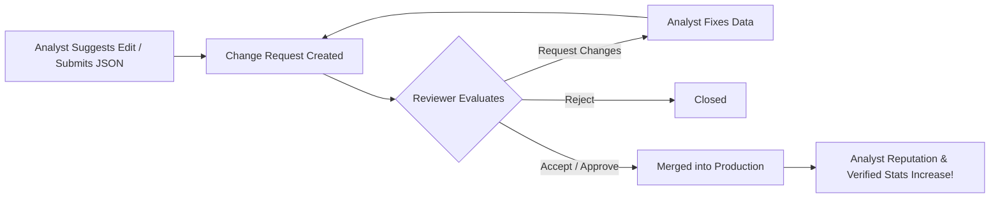

# 📊 Moncho Analyst Dashboard Walkthrough

Welcome to the **Analyst Dashboard Walkthrough**. While your local IDE is your "Data Engine" (Hub 1), the **Analyst Dashboard (Hub 2)** is your command center. It is hosted at:
👉 **[app.moncho.ai/analyst/dashboard](https://app.moncho.ai/analyst/dashboard)**

This walkthrough explains how to apply, navigate the dashboard, manage your credentials, track your submissions, and utilize the full suite of curation tools.

---

## 📚 Table of Contents
1. [The Onboarding & Application Flow](#1-the-onboarding--application-flow)
2. [The Central Dashboard Overview](#2-the-central-dashboard-overview)
3. [Managing Workbench Access (API Keys)](#3-managing-workbench-access-api-keys)
4. [Sidebar Tools: The Analyst OS](#4-sidebar-tools-the-analyst-os)
5. [The Lifecycle of a Change Request](#5-the-lifecycle-of-a-change-request)

---

## 1. The Onboarding & Activation Flow

Analyst access is **instant** — no application form or admin approval wait.

```mermaid
graph TD
    A[Login to app.moncho.ai] --> B{Has analyst_profiles row?}
    B -- No --> C[/analyst/apply]
    C --> D[Click Become Analyst for Free]
    D --> E[POST /api/analyst/activate]
    E --> F[/analyst/dashboard?welcome=1]
    B -- Yes --> F
```

### Steps to activate:
1. Log in via email or Google.
2. Visit **[app.moncho.ai/analyst/apply](https://app.moncho.ai/analyst/apply)** (or use the footer link).
3. Click **Become Analyst for Free** — your profile is created immediately.
4. You receive **3 days of full Analyst entitlements** (Sherpa 10/day, Data Terminal analyst quotas).
5. **Keep free Analyst access forever** after **one approved submission**, or upgrade to Pro at any time.

> Manual SQL grants in Supabase are legacy-only (e.g. promoting `senior_analyst` / `admin` roles).

---

## 2. The Central Dashboard Overview (Command Center)

The dashboard is your **Analyst Command Center** — awareness and orientation, not a duplicate of My Work.

```
+------------------------------------------------------------------------+
| IDENTITY: Name · Verified Analyst · Reputation · Profile link          |
+------------------------------------------------------------------------+
| Welcome back · pending count · Sherpa quota (single strip)             |
+------------------------------------------------------------------------+
| TODAY: Market Pulse (per coverage sector) · Knowledge Graph Growth     |
+------------------------------------------------------------------------+
| CONTINUE: What's Next (one CTA) · AI Suggestions                       |
+------------------------------------------------------------------------+
| YOUR WORK: Knowledge Assets · Activity Timeline                        |
+------------------------------------------------------------------------+
| MY COVERAGE: sector cards (coverage %, freshness, gaps)               |
+------------------------------------------------------------------------+
| QUICK ACTIONS: Run workflow · Data Terminal · Suggest edit · Reports   |
+------------------------------------------------------------------------+
```

### Zones

- **Identity strip**: Reputation score/rank, **distinct org edits approved**, reports published, link to public profile (`/a/[username]`).
- **Today**: Market Pulse shows 7-day events for sectors you cover. Graph Growth shows platform-wide 24h deltas (orgs, products, prices, experts, policies, value chains).
- **Continue**: One state-driven **What's Next** card. **AI Suggestions** surface pending candidate facts from your queue and covered sectors (up to 3).
- **Your work**: Recent knowledge assets (briefs, exports) and a unified activity timeline (submissions, Sherpa, announcements).
- **My coverage**: Domains you own — configure up to 6 sectors in **Settings → Coverage**.

### What moved off the dashboard

- **Full workflow launcher** → My Work (`/analyst/work?tab=workflows`)
- **API keys** → Settings (`/analyst/settings`)
- **Duplicate KPI cards** and Sherpa sidebar widget → removed

> Formal UAC details: ask founder if you need acceptance-criteria docs beyond this walkthrough.

---

## 3. Managing Workbench Access (API Keys)

API keys are on **Settings**, not the dashboard.

To run local developer tools (Hub 1) and submit data using scripts, you need your unique API credential.

> [!WARNING]
> Your API key grants write permission to create change requests under your name. Keep it completely secret and never commit it to public repositories.

### Configuring Your Key:
1. Open **Settings** in the sidebar (`/analyst/settings`).
2. Under **Developer**, reveal and copy your API Key (or generate one).

### Coverage sectors (Market Pulse + My Coverage)
1. In **Settings → Coverage**, select up to **6 sectors** you research.
2. If you completed consumer onboarding, sectors you follow may be **pre-filled automatically** (from `user_sectors` or your profile preferences). You can change them anytime.
3. Click **Save coverage** — this writes `coverage_sector_slugs` on your analyst profile.
4. Reload the dashboard to see **Market Pulse** and **My Coverage** cards for those sectors.

### Public profile (`/a/[username]`)

Your shareable analyst portfolio at `/a/{username}` (link from the dashboard identity strip or sidebar **Public Profile**).

| Section | What it shows |
|---------|----------------|
| Stats | Distinct org edits approved, maps curated, reputation score/rank |
| Contribution Activity | GitHub-style heatmap from verified `audit_logs` |
| Recent Contributions | Last 20 approved/completed edits with entity-aware labels |
| Portfolio Projects | Links and descriptions you add via **Edit Portfolio** |

Empty states guide you to submit work or add bio/projects. The placeholder **Contact Analyst** card was removed until a real enquiry flow ships.

Apply migration `20260709030000_analyst_profile_projects.sql` if portfolio saves fail (adds `analyst_profiles.projects` jsonb column).

### Local workbench key
1. In your local clone of the `Moncho-Analysts` workbench repository, create a `.env` file in the root directory.
2. Add the key as follows:
   ```env
   MONCHO_API_URL="https://app.moncho.ai"
   MONCHO_AUTH_TOKEN="your_copied_api_key_here"
   ```
3. Ensure your `.env` is listed in your `.gitignore` to prevent leaks.

---

## 4. Sidebar Tools: The Analyst OS

The sidebar navigation provides access to specific database curation modules:

| Sidebar Module | Path | Purpose |
| :--- | :--- | :--- |
| **Dashboard** | `/analyst/dashboard` | Command Center — market pulse, what's next, assets, activity, coverage. |
| **My Work** | `/analyst/work` | Workflow launcher, in-progress threads, intelligence, submissions, exports. |
| **Settings** | `/analyst/settings` | API keys (Developer) and coverage sector editor (max 6). |
| **Review Queue** | `/analyst/review` | *[Senior Analysts/Admins only]* Evaluate and vote on pending analyst submissions. |
| **Organizations** | `/analyst/organizations` | Search and browse the database. Suggest inline edits for metadata, websites, descriptions, and rationales. |
| **Reports** | `/analyst/reports` | View and manage rich Market Sizing / SML (Structured Market Landscape) reports. |
| **Products** | `/analyst/products` | Curate `product_metrics` rows (pricing, variants, segment placement). Not the `products` catalog table. |
| **Metadata Manager**| `/analyst/metadata` | Sectors, segments, countries, **taxonomy standards**, and **HS codes** (read + suggest edits). |
| **Value Chain** | `/analyst/value-chain` | Manage stages, gaps, and HS→stage mappings per pilot; preview consumer tabs (chain, exporters, gaps). |
| **Landscape Builder**| `/analyst/landscapes` | Interactive visual tool to drag, drop, and map organizations onto sector layouts. |
| **Sherpa AI** | `/sherpa` | Deep research agent. Run top-down and bottom-up market sizing operations directly in the browser. |
| **Public Profile** | `/a/[username]` | Shareable portfolio: reputation, org edits, contribution heatmap, recent verified edits, and portfolio projects. Edit via **Edit Profile** on your own page. API keys and coverage stay in **Settings**. |

---

## 5. The Lifecycle of a Change Request

Every change you make on the dashboard or submit via the local workbench script follows a rigorous review pipeline:



1. **Submission**: You suggest an edit on a website profile or run `npm run submit` locally.
2. **Audit Logging**: The request is created in the `audit_logs` table with a `pending` status.
3. **Review**: Senior Analysts or Admins audit the changes using the **Review Queue** (`/analyst/review`).
4. **Scoring**: The Judge Agent assesses the submission quality.
5. **Resolution**:
   - **Approved**: The change is instantly applied to the live database, and your statistics are updated.
   - **Changes Requested**: The reviewer provides feedback, and you can submit a corrected version.
   - **Rejected**: Inaccurate or duplicate submissions are declined.

---

> [!NOTE]
> If you run into technical errors or need schema adjustments, reach out to the core engineering team. For styling and data curation rules, click the **"Guide"** button at the bottom of the sidebar to view the in-app guide at `/analyst/guide`.
