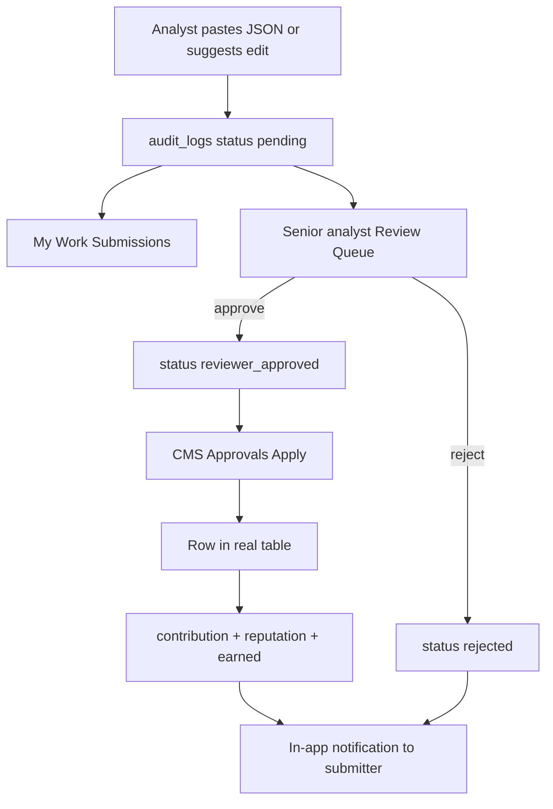

# Moncho Analyst Dashboard Walkthrough

Welcome to the **Analyst Dashboard Walkthrough**. While your local IDE is your "Data Engine" (Hub 1), the **Analyst Dashboard (Hub 2)** is your command center. It is hosted at:
👉 **[app.moncho.ai/analyst/dashboard](https://app.moncho.ai/analyst/dashboard)**

This walkthrough explains how to apply, navigate the dashboard, manage your credentials, track your submissions, and use the curation tools (including Data Terminal, Bulk inject, and My Work).

---

## Table of Contents
1. [The Onboarding & Application Flow](#1-the-onboarding--activation-flow)
2. [The Central Dashboard Overview](#2-the-central-dashboard-overview-command-center)
3. [Managing Workbench Access (API Keys)](#3-managing-workbench-access-api-keys)
4. [Sidebar Tools: The Analyst OS](#4-sidebar-tools-the-analyst-os)
5. [My Work](#5-my-work)
6. [Data Terminal (quick reference)](#6-data-terminal-quick-reference)
7. [The Lifecycle of a Change Request](#7-the-lifecycle-of-a-change-request)

---

## 1. The Onboarding & Activation Flow

Analyst access is **instant** — no application form or admin approval wait.

```mermaid
graph TD
    A[Login to app.moncho.ai] --> B{Has analyst_profiles row?}
    B -- No --> C[/analyst/apply]
    C --> D[Click Become Analyst for Free]
    D --> E[POST /api/analyst/activate]
    E --> F[/analyst/dashboard?welcome=1]
    B -- Yes --> F
```

### Steps to activate:
1. Log in via email or Google.
2. Visit **[app.moncho.ai/analyst/apply](https://app.moncho.ai/analyst/apply)** (or use the footer link).
3. Click **Become Analyst for Free** — your profile is created immediately.
4. You receive **3 days of full Analyst entitlements** (Sherpa 10/day, Data Terminal analyst quotas).
5. **Keep free Analyst access forever** after **one applied/completed submission** (`audit_logs.status` = `completed` or legacy `approved`), or upgrade to Pro at any time.

> Manual SQL grants in Supabase are legacy-only (e.g. promoting `senior_analyst` / `admin` roles).

---

## 2. The Central Dashboard Overview (Command Center)

The dashboard is your **Analyst Command Center** — awareness and orientation, not a duplicate of My Work.

```
+------------------------------------------------------------------------+
| IDENTITY: Name · Verified Analyst · Reputation · Profile link          |
+------------------------------------------------------------------------+
| Welcome back · pending count · Sherpa quota (single strip)             |
+------------------------------------------------------------------------+
| TODAY: Market Pulse (per coverage sector) · Knowledge Graph Growth     |
+------------------------------------------------------------------------+
| CONTINUE: What's Next (one CTA) · AI Suggestions                       |
+------------------------------------------------------------------------+
| YOUR WORK: Knowledge Assets · Activity Timeline                        |
+------------------------------------------------------------------------+
| MY COVERAGE: sector cards (coverage %, freshness, gaps)               |
+------------------------------------------------------------------------+
| QUICK ACTIONS: Run workflow · Data Terminal · Suggest edit · Reports   |
+------------------------------------------------------------------------+
```

### Zones

- **Welcome banner** (trial / first visit): shown when entitlements load; dismissible. Driven by `?welcome=1` after activation.
- **Identity strip**: Reputation score/rank, **distinct org edits approved** (statuses `approved`/`completed`), reports published, link to public profile (`/a/[username]`).
- **Submission summary strip**: pending / in review / applied / rejected counts with link to My Work → Submissions.
- **Today**: Market Pulse shows 7-day events for sectors you cover. Graph Growth shows platform-wide deltas (orgs, products, prices, experts, policies, value chains, market facts / trade where shown).
- **Continue**: One state-driven **What's Next** card. **AI Suggestions** surface pending candidate facts from your queue and covered sectors (up to 3).
- **Your work**: Recent knowledge assets (briefs, exports) and a unified activity timeline (submissions, Sherpa, announcements).
- **My coverage**: Domains you own — configure up to 6 sectors in **Settings → Coverage**.
- **Getting started checklist**: Completing “get a suggestion approved” counts when a submission reaches **`completed`** (live apply) or legacy **`approved`**.

### What moved off the dashboard

- **Full workflow launcher** → My Work (`/analyst/work?tab=workflows`)
- **API keys** → Settings (`/analyst/settings`)
- **Duplicate KPI cards** and Sherpa sidebar widget → removed

### Troubleshooting

| Symptom | Likely cause | What to check |
|---------|--------------|---------------|
| **"Something went wrong!"** on `/analyst/dashboard` with console **Server Components render** error (message omitted in production) | Server Component threw during render | Local: reproduce with `npm run dev` and read the full stack. Common: missing import still used in JSX (see [IDE_AGENT_MISTAKES X-27](../06-operations/IDE_AGENT_MISTAKES.md)). Prod: Vercel function logs for the digest. |
| Console `POST /ingest/…` **`ERR_BLOCKED_BY_CLIENT`** | Ad blocker / tracking protection blocking PostHog | Harmless for dashboard render; not a root cause of the error boundary. |
| `[UserContext] No client session` then **Server-side auth found** | Cookie hydration lag | Expected if the page still loads; only treat as auth failure if the page redirects to login. |

> Formal UAC details: [ANALYST_DASHBOARD_UAC.md](../03-product-and-design/ANALYST_DASHBOARD_UAC.md).

---

## 3. Managing Workbench Access (API Keys)

API keys are on **Settings**, not the dashboard.

To run local developer tools (Hub 1) and submit data using scripts, you need your unique API credential.

> [!WARNING]
> Your API key grants write permission to create change requests under your name. Keep it completely secret and never commit it to public repositories.

### Configuring Your Key:
1. Open **Settings** in the sidebar (`/analyst/settings`).
2. Under **Developer**, reveal and copy your API Key (or generate one).

### Coverage sectors (Market Pulse + My Coverage)
1. In **Settings → Coverage**, select up to **6 sectors** you research.
2. If you completed consumer onboarding, sectors you follow may be **pre-filled automatically** (from `user_sectors` or your profile preferences). You can change them anytime.
3. Click **Save coverage** — this writes `coverage_sector_slugs` on your analyst profile.
4. Reload the dashboard to see **Market Pulse** and **My Coverage** cards for those sectors.

### Public profile (`/a/[username]`)

Your shareable analyst portfolio at `/a/{username}` (link from the dashboard identity strip or sidebar **Public Profile**).

| Section | What it shows |
|---------|----------------|
| Navigation | **Back** uses browser history when available, otherwise Home (`/`). Logged-in analysts and profile owners also see **Workbench** → `/analyst/dashboard`. |
| Stats | Distinct org edits approved, maps curated, reputation score/rank |
| Contribution Activity | Amber/primary heatmap from verified `audit_logs`; year tabs only for years with activity |
| Recent Contributions | Last 20 approved/completed edits with entity-aware labels; links to `/organizations/{slug}` when the org resolves |
| **Portfolio** | Auto: published Sherpa reports from `analysis_reports`. Manual: validated custom links in `analyst_profiles.projects` (`/analysis-reports/*`, `/organizations/*`, or external https). Invalid `/maps/*` placeholders are filtered on read and blocked on save. |

Empty states guide you to submit work or add bio/projects. The placeholder **Contact Analyst** card was removed until a real enquiry flow ships.

Apply migration `20260709030000_analyst_profile_projects.sql` if portfolio saves fail (adds `analyst_profiles.projects` jsonb column).

### Local workbench key
1. In your local clone of the `Moncho-Analysts` workbench repository, create a `.env` file in the root directory.
2. Add the key as follows:
   ```env
   MONCHO_API_URL="https://app.moncho.ai"
   MONCHO_AUTH_TOKEN="your_copied_api_key_here"
   ```
3. Ensure your `.env` is listed in your `.gitignore` to prevent leaks.

---

## 4. Sidebar Tools: The Analyst OS

The left nav collapses to icons on narrow layouts. When collapsed, **hover a nav icon** to see its name (tooltip). The same pattern applies on Admin CMS and Sector hub sidebars.

| Sidebar Module | Path | Purpose |
| :--- | :--- | :--- |
| **Dashboard** | `/analyst/dashboard` | Command Center — market pulse, what's next, assets, activity, coverage. |
| **My Work** | `/analyst/work` | In-progress threads, intelligence, submissions, downloads, workflow launcher. Filter / sort / paginate list tabs. |
| **Review Queue** | `/analyst/review` | *[Senior Analysts/Admins only]* Evaluate pending submissions; claim unassigned rows; approve / reject. |
| **Organizations** | `/analyst/organizations` | Search and browse the database (paginated: 20/50/100 rows). Organization names and **View** link open the public profile at `/organizations/{slug}`. Suggest inline edits for metadata, websites, descriptions, and rationales. |
| **Reports** | `/analyst/reports` | View and manage rich Market Sizing / SML reports. |
| **Data Terminal** | `/analyst/data-terminal` | Explore catalog tables, join analysis (Paid+), export under role limits. See [DATA_TERMINAL_V1.md](../03-product-and-design/DATA_TERMINAL_V1.md). |
| **Bulk inject** | `/analyst/bulk-inject` | Paste JSON batches as change requests for human review (not an automatic gap scan). |
| **Products** | `/analyst/products` | Curate `product_metrics` rows (pricing, variants, segment placement). Paginated (20/50/100). Prices show compact K/M/B/T; organization pills link to `/organizations/{slug}` when available. |
| **Metadata Manager**| `/analyst/metadata` | Sectors, segments, countries, taxonomy standards, and HS codes (read + suggest edits). |
| **Value Chain** | `/analyst/value-chain` | Manage stages, gaps, and HS→stage mappings per pilot. |
| **Landscape Builder**| `/analyst/landscapes` | Interactive tool to map organizations onto sector layouts. |
| **Run analysis** | `/sherpa?from=analyst` | Sherpa deep research / market sizing. |
| **Settings** | `/analyst/settings` | API keys (Developer) and coverage sector editor (max 6). |
| **Public Profile** | `/a/[username]` | Shareable portfolio. Edit via **Edit Profile** on your own page. |

---

## 5. My Work

Route: **`/analyst/work`**. Tabs:

| Tab | Contents |
|-----|----------|
| **In progress** | Open Sherpa threads (continue in Sherpa). |
| **Intelligence** | Saved briefs / table artifacts; open, export, suggest edit. |
| **Submissions** | Change requests you submitted (orgs, products, media, metadata, landscapes) **plus your staged market facts**, and optional web-discovered Sherpa candidate facts. |
| **Downloads** | Completed Data Terminal export jobs. |
| **Run workflow** | Compact workflow launcher (same modes as Sherpa home). |

### List toolbar (all list tabs)

Each list tab (except Run workflow) has:

- **Search** (title / name where useful)
- **Filter** (status, kind, etc.)
- **Sort** (newest, oldest, title A–Z)
- **Pagination** (10 per page, Previous / Next, “Showing X–Y of N”)

### Submissions details

**Primary home:** `/analyst/work?tab=submissions` (full paginated history). **Detail:** `/analyst/submissions/[id]` (timeline, notes, payload summary).

Summary cards at the top show server-side counts for **Pending**, **In review** (includes `changes_requested`), **Applied**, **Rejected**, and **All**. Entity-type chips filter the table (Orgs, Products, Media, etc.).

Two sections on the tab:

1. **Web-discovered facts awaiting review** — promote a candidate into the change-request queue.
2. **Change request submissions** — your `audit_logs` rows (paginated, not capped at 50).

Rows are clickable and open the detail page. Reviewer/agent notes appear for in-review, changes-requested, and rejected rows.

**Channel attribution** (after DB patch `20260723120000_audit_logs_submission_metadata`): bulk inject, CLI (`npm run submit`), API key, and form UI submissions store `submission_channel` and optional `batch_id` (shared per bulk inject session). Since 2026-07-24 the UI shows a friendly label per channel (`formatSubmissionChannelLabel`) instead of the raw snake_case value — e.g. `cli` → **"CLI / IDE terminal"**, `bulk_inject` → **"Bulk Inject UI"**. Legacy `analyst_bulk_inject` rows (pre-dating per-channel tracking) show **"Bulk Inject (legacy)"** — if you submitted via CLI or a form before this patch shipped, your rows may still show that legacy label even though you did not use Bulk Inject.

Status filter vocabulary (live path):

| Filter | Matches |
|--------|---------|
| Pending | `pending` |
| In review | `reviewer_approved`, legacy `reviewed`, `changes_requested` |
| Completed (injected) | `completed` or legacy `approved` |
| Rejected | `rejected` |

Toolbar counts reflect **all** your submissions (server summary), not just the current page. Completing the checklist “get a suggestion approved” and earning permanent Analyst access both treat **`completed` as success** (same as this Completed filter).

### Dual roles (submitter vs reviewer)

If you are a senior analyst or admin who also submits data, keep the surfaces separate:

| Hat | Surface | What you do |
|-----|---------|-------------|
| **Submitter** (every role) | My Work → Submissions | Track **your** rows only; no approve/reject here |
| **Reviewer** | Review Queue `/analyst/review` | Claim, approve, reject peers' rows |
| **Publisher** | CMS Approvals | Apply `reviewer_approved` rows to live data |

**Self-review:** reviewers and analyst admins **cannot** claim, approve, reject, or publish rows where `submitted_by` is themselves. The sole exception is platform **`users.access_role === 'super_admin'`** (founder break-glass). Analyst profile `admin` and CMS `Admin` are **not** exempt.

Command Center shows a submission breakdown strip with counts and a link to submission history.

---

## 6. Data Terminal (quick reference)

Route: **`/analyst/data-terminal`** (also available in CMS). Full product doc: [DATA_TERMINAL_V1.md](../03-product-and-design/DATA_TERMINAL_V1.md).

| Tab | What it does |
|-----|----------------|
| **Explore** | Pick a dataset, set filters (each field has a visible label; enums use dropdowns), **Run query**. Analyst OS also has **Ask Sherpa** (Quick Lookup with country / metric context; does **not** send table rows) and **Submit missing rows** → Bulk inject. |
| **Catalog** | Discover datasets and tier / availability status. |
| **Analyze** | Guided join of two tables from fixed join paths; column sketch before Run; row table after Run. |
| **Library** | Saved join drafts and exports. |

**Free** sees `market_facts` only. **Paid+ / Analyst** also get competencies, occupations, value-chain tables, plus read-only browse: **organizations**, **HS codes**, **taxonomy standards**, **countries**.

---

## 7. The Lifecycle of a Change Request

Every change you make on the dashboard, Bulk inject, or via the local workbench script goes through a **human review pipeline**. Nothing is written to live tables on submit alone.



### Status vocabulary (live path)

| Status | Meaning |
|--------|---------|
| `pending` | Submitted; waiting for a reviewer |
| `reviewer_approved` | Senior analyst approved; waiting for CMS **Apply** |
| `completed` | Admin applied the change to production |
| `rejected` | Declined (notes may appear in My Work) |
| `changes_requested` | Reviewer asked for a fix |

Legacy / orphan path may still show `reviewed` → `approved`. Treat **`completed` and `approved` as “success”** in filters and entitlements.

### Steps in practice

1. **Submission**: Suggest an edit, use **Bulk inject** (`/analyst/bulk-inject`), or run `npm run submit` locally.
   - Orgs, products, metadata, landscapes → `audit_logs` (`pending`).
   - **Market facts** → `staging_market_facts` (`pending_review`); reviewed on **Review Queue → Staged market facts** (not CMS).
2. **Track**: Open **My Work → Submissions** for change-request status **and** your staged market facts (same list; filter chip **Market facts**).
3. **Review**: Senior Analysts / Admins use **Review Queue** with three tabs: **Analyst submissions**, **Staged market facts**, **Sherpa research candidates**.
   - **Summary strip:** pending total, agent accept/reject/changes/untriaged, human approved, applied. Click chips to filter.
   - **Analyst submissions table:** separate **Human status** and **Agent verdict** columns; agent reason truncated from triage feedback. Bulk approve/reject/request changes with checkbox selection.
   - **Sherpa research candidates**: metrics Sherpa found via web search, queued for SML review (not live publish). Reviewers see source URL, metric, and a question snippet only. They do **not** get thread links or access to end-user Sherpa conversations. Pagination: 20 / 50 / 100 per page.
4. **Apply (CMS)**: After `reviewer_approved`, an Admin applies via CMS Approvals (single row or **Apply selected** bulk bar).
   - **CREATE organization** (null `entity_id`): inserts into `metadata_organization`.
   - **UPDATE organization**: RPC `apply_organization_changes`.
   - **Metadata** (`entity_type: metadata`): requires `metadata_type` (`sector` / `segment` / `need`) on the payload or Bulk inject default.
5. **Credit**: Successful apply increments contribution stats, runs `syncAnalystReputation`, may set `entitlement_source = earned`, and creates a **user notification** for the submitter. Rejection also notifies in-app (email still deferred).

### Bulk inject notes

- Paste a JSON **array** (max 50 records). Each array element is one org, product, metadata row, landscape, or market fact.
- Entity types: **Organization**, **Product**, **Market fact** (→ `staging_market_facts`, review on **Review Queue → Staged market facts**), **Metadata**, **Landscape**.
- For metadata rows, set `metadata_type` on each object or use the Bulk inject default dropdown.
- Organization **creates** need `name`; product **creates** need `product_name`.
- Market fact rows need `metric_key`, `country`, `year`, `value`, `unit`, `source_name`.
- IDE CLI: `npm run submit -- --file path.json --type organization|product|market_fact|metadata|landscape`

For reviewer/admin integration buckets, see [REVIEW_QUEUE_PLAYBOOK.md](../06-operations/REVIEW_QUEUE_PLAYBOOK.md).

---

> If you run into technical errors or need schema adjustments, reach out to the core engineering team. For styling and data curation rules, click the **"Guide"** button at the bottom of the sidebar to view the in-app guide at `/analyst/guide`.
